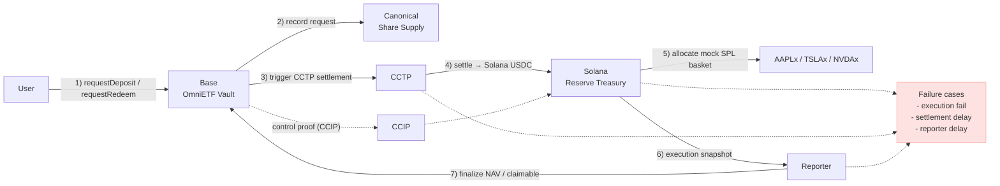
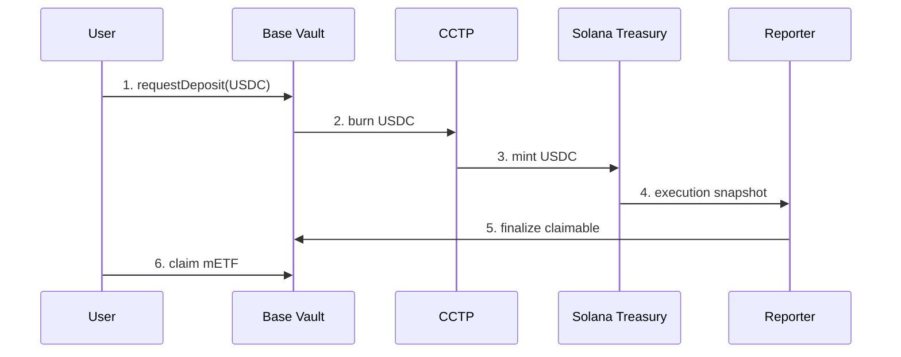
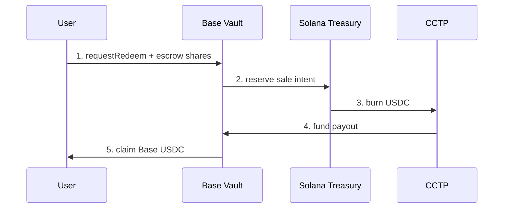

<div class="kicker">Blockchain Practice Final Presentation</div>

# OmniETF

## Cross-chain Basket Share Accounting Protocol

멀티체인 reserve를  
하나의 share / NAV / redeem claim으로 묶는 PoC

<!--
표준이 아니라 프로토콜 아이디어로 시작합니다.
법적 ETF가 아니라 ETF-like basket share accounting protocol입니다.
-->

---
layout: default
---

# 목차

1. Abstract
2. Background
3. Motivation
4. Problem
5. Protocol Structure
6. Implementation
7. Demo
8. Limitations

<!--
참고 자료처럼 단순하고 명확한 목차로 시작합니다.
-->

---
layout: section
---

# 1. Abstract

OmniETF는 cross-chain 자산 운용에서  
사용자가 USDC를 가지고, 하나의 share로 basket exposure를 보유하고  
환매할 수 있는 구조를 실험합니다.

---
layout: default
---

# Abstract

현재 멀티체인 환경이더라도 자산, 유동성, 실행 상태가 체인별로 분리되어 있습니다.

하지만 사용자는 여러 체인의 잔고를 직접 추적하기보다  
하나의 자산, 하나의 네트워크로 포트폴리오, 하나의 NAV, 하나의 환매 권리를 가진다면 보다 효율적으로 자산을 운용할 수 있습니다. 

OmniETF는 이 문제를 해결하기 위해:

- Base에 canonical share와 request accounting을 둠
- Solana에 reserve execution과 SPL custody를 둠
- CCTP로 USDC settlement를 수행
- CCIP로 control message와 test-token round trip을 검증

<!--
여기서 ERC 표준 이야기를 하지 않습니다.
사용자 문제와 시스템 구조만 말합니다.
-->

---
layout: section
---

# 2. Background

자산은 멀티체인화됐지만  
portfolio accounting은 아직 사용자에게 떠넘겨져 있습니다. 

---
layout: default
---

# 멀티체인 환경의 변화

- 자산은 여러 체인에 배포됨
- 유동성은 체인별로 분절됨
- settlement와 execution의 시간이 다름
- 사용자는 bridge, wallet, explorer, portfolio tracker를 오가야 함

<div class="mt-8 big-claim">
문제는 "어떻게 자산을 세분화해서 옮길까"보다<br/>"무엇을 하나의자산군으로 하나의 ETF형태로 보여줄까"입니다.
</div>

<!--
외부 리서치의 chain abstraction / unified balance framing을 발표용으로 단순화합니다.
-->

---
layout: default
---

# 문제정의

멀티체인 포트폴리오에서 사용자가 원하는 것은  
여러 chain state의 나열이 아니라 **단일한 청구권**입니다.
즉, 한번의 트랜잭션으로 여러 자산군에 대한 포지션을 구축하고, 한번의 트랜잭션으로 이를 정리할 수 있습니다.

| 분리된 상태 | 사용자가 원하는 상태 |
|---|---|
| Base wallet balance | 내가 가진 share |
| Solana token account | reserve가 실제 존재하는지 |
| CCTP attestation | settlement가 끝났는지 |
| CCIP message | execution/control intent가 전달됐는지 |
| 가격과 수량 | 현재 NAV와 redeem 가능 금액 |

<div class="mt-7 big-claim">
OmniETF는 bridge product가 아니라<br/>cross-chain claim accounting problem입니다.
</div>

---
layout: default
---

# 기존 사용자의 경험

| 사용자가 해야 하는 일 | 실제로 어려운 이유 |
|---|---|
| 어느 체인에 자산이 있는지 확인 | 체인별 잔고와 token account가 다름 |
| bridge 상태 확인 | finality와 attestation 대기 |
| 실행 결과 확인 | swap, custody, ledger가 별도 |
| 총 가치를 계산 | 가격과 비중을 직접 합산 |
| 환매 가능 여부 판단 | 어느 체인에서 얼마가 claimable인지 불명확 |

---
layout: default
---

# 우리가 원하는 경험

사용자는 내부 cross-chain 과정을 몰라도 됩니다.

사용자는 다음 세 가지만 보면 됩니다.

<div class="mt-8">
  <span class="pill">내 share 수량</span>
  <span class="pill">현재 NAV</span>
  <span class="pill">환매 가능한 USDC</span>
</div>

<div class="mt-10 big-claim">
OmniETF의 목표는 bridge UI가 아니라<br/>claim surface를 만드는 것입니다.
</div>

---
layout: section
---

# 3. Motivation

왜 이 문제에 블록체인이 필요한가?

---
layout: default
---

# 단순 대시보드로는 부족합니다

Off-chain dashboard는 잔고를 보여줄 수는 있지만  
사용자의 권리를 상태로 만들지는 못합니다.

| Dashboard | Protocol |
|---|---|
| 보여줌 | 발행/환매 권리를 상태화 |
| 운영자가 계산 | 컨트랙트가 조건 강제 |
| 잔고 표시 | share supply와 claim 기록 |
| 사용자 신뢰 필요 | tx와 state로 검증 가능 |

---
layout: default
---

# 블록체인을 쓰는 이유

- share 발행 조건을 공개적으로 강제
- redeem request와 claimable 상태를 추적
- reserve-backed claim을 tx로 검증
- reporter가 어떤 실행가치를 반영했는지 기록
- 사용자가 explorer에서 상태를 확인 가능

<div class="mt-8 source">
이 프로젝트의 핵심은 하나의 금융 상품 출시보다는, cross-chain accounting state machine 검증입니다.
</div>

---
layout: section
---

# 4. Problem

기존 basket, vault, bridge는 각각 강하지만  
이 문제를 한 번에 해결하지는 않습니다.

---
layout: default
---

# 기존 접근의 역할

| 접근 | 잘하는 것 |
|---|---|
| Basket token | 여러 자산 exposure를 하나의 토큰으로 표현 |
| Vault | share와 asset accounting |
| Bridge / messaging | 체인 간 자산 또는 메시지 이동 |
| CCTP | native USDC burn / mint settlement |
| Portfolio tracker | 잔고와 가격 표시 |

---
layout: default
---

# 남는 빈칸

| 질문 | 왜 어려운가 |
|---|---|
| Base에서 deposit한 순간 share를 바로 줄 수 있나? | Solana 실행가치가 아직 모름 |
| bridge는 완료됐는데 basket은 구성됐나? | settlement와 execution이 별개 |
| NAV는 누가 언제 확정하나? | 가격, 수량, fee, finality가 필요 |
| redeem은 어떤 자산으로 backing되나? | reserve liquidation과 payout이 필요 |

<div class="mt-8 big-claim">
Cross-chain에서는 deposit이 곧 NAV 확정이 아닙니다.
</div>

---
layout: default
---

# 실패 모드

즉시 mint 방식은 cross-chain에서 다음 문제를 만듭니다.

| 실패 모드 | 결과 |
|---|---|
| bridge는 됐지만 Solana 실행 실패 | share가 reserve 없이 발행됨 |
| 실행 가격이 예상보다 나쁨 | 기존 holder가 손해를 봄 |
| reporter가 늦게 반영 | NAV와 claimable state가 어긋남 |
| redeem settlement가 지연 | burn/escrow 이후 payout timing이 불명확 |

<div class="mt-8 big-claim">
그래서 핵심은 빠른 mint가 아니라<br/>언제 mint해도 되는지 증명하는 것입니다. 즉, 포지션에 대해 자유를 부여하는 것 입니다. 
</div>

---
layout: default
---

# 핵심 설계 질문

OmniETF가 다루는 질문은 단순합니다.

<div class="mt-8 big-claim">
운용 체인과 사용자 체인이 달라도<br/>하나의 share supply와 하나의 NAV를 유지할 수 있는가?
</div>

---
layout: section
---

# 5. Protocol Structure

Base는 share accounting,  
Solana는 reserve execution,  
CCTP는 settlement-control rail입니다.

---
layout: default
---

# Trust Model — Who / What / Assumptions

이 프로토콜이 제대로 동작할려면 특정 핵심 기술을 신뢰를 바탕이 되어야 합니다.
아래는 핵심 신뢰 기술을 정리했습니다. 

| Actor | Role | Trust / Assumption |
|---|---|---|
| CCTP (Circle) | USDC settlement attestation | Circle의 attestation을 settlement finality로 신뢰함 |
| CCIP (DON) | Control message delivery | 메시지 전달을 신뢰하되 value settlement는 아님 |
| Reporter | 실행 결과(NAV) 확정자 | PoC에서는 centralized finalizer — 추후 threshold/replicated oracle 필요 |
| Solana Reserve / Program | custody & execution | 프로그램 로직과 custody가 의도대로 동작한다고 가정 (실패 케이스 존재) |
| Base Vault | canonical share accounting | 모든 claim/state는 Base vault의 기록을 따름 |

간단한 실패 가정 및 완화:
- CCTP attestation 지연/실패 → settlement 보류, claim 지연 (증거 타임아웃/rollback 필요)
- Solana execution 실패 → reporter가 실패로 표시하고 refund/재시도 경로 발생
- Reporter 지연/악의적 행위 → multisig/threshold reporter로 권한 분산 검토

---
layout: default
---

# Protocol Diagram



<!--
Protocol Diagram은 참고 자료의 PawnDAO 구조도 역할입니다.
-->

---
layout: default
---

# Chain별 역할

| 구성요소 | 역할 |
|---|---|
| Base Vault | deposit/redeem request, share supply, claim 상태 관리 |
| Solana Treasury | reserve custody, basket execution 결과 보관 |
| CCTP | Base USDC와 Solana USDC 사이의 settlement |
| CCIP | control message와 test-token round trip 검증 |
| Reporter | Solana 실행 결과를 Base NAV로 확정 |

---
layout: default
---

# 설계 원칙

| 원칙 | 적용 |
|---|---|
| mint는 실행 후에만 | `requestDeposit` 시점에는 mETF를 주지 않음 |
| settlement와 execution 분리 | CCTP 수신과 Solana basket allocation을 별도 stage로 표시 |
| NAV는 reporter가 확정 | executed value가 Base vault state에 반영되어야 claim 가능 |
| redeem은 비동기 claim | share escrow 이후 backing USDC가 있을 때 지급 |
| evidence first | 모든 stage는 tx hash, explorer, code path로 설명 |

---
layout: default
---

# Deposit Process



---
layout: default
---

# Redeem Process



---
layout: default
---

# NAV 확정 방식

NAV는 단순 화면 숫자가 아니라  
share mint/redeem의 기준입니다.

| 시점 | 처리 |
|---|---|
| 첫 deposit | NAV = 1 |
| 이후 deposit | minted shares = executedValue / navBefore |
| redeem request | shares escrow |
| redeem claim | backing USDC 확인 후 payout |

---
layout: default
---

# Token Standards는 도구입니다

이 발표의 주인공은 ERC 표준이 아니라  
cross-chain basket-share accounting lifecycle입니다.

| 도구 | 쓰는 이유 |
|---|---|
| ERC-20 | mETF share를 표현하기 위해 |
| ERC-4626 | asset/share 계산 언어를 빌리기 위해 |
| ERC-7540 | request/claim 비동기 흐름을 표현하기 위해 |
| ERC-7621 | basket weight vocabulary를 빌리기 위해 |
| SPL Token | Solana reserve custody를 보이기 위해 |

<!--
사용자 요청 반영: "4626은 출발점..." 같은 표현을 빼고, 표준은 도구일 뿐이라고 명확히 말합니다.
-->

---
layout: section
---

# 6. Implementation

이번 구현은 production ETF가 아니라  
end-to-end accounting path를 검증하는 PoC입니다.

---
layout: default
---

# 구현 범위

| 영역 | 구현 |
|---|---|
| Base | async vault, mETF share, request/redeem lifecycle |
| CCTP | Base ↔ Solana USDC settlement scripts |
| Solana | mock xStock SPL basket ledger / custody |
| Reporter | executed value finalization |
| CCIP | Base ↔ Solana control message, CCIP-BnM round trip |
| UI | pipeline stage별 tx evidence와 ledger 상태 표시 |

---
layout: default
---

# 구현하지 않은 것

- 법적 ETF 구조
- issuer-backed real xStock 매수/매도
- production oracle / reporter network
- automated liquidation
- automated rebalance
- CCIP 기반 USDC settlement claim

<div class="mt-8 big-claim">
과장하지 않는 것이 이 PoC의 방어력입니다.
</div>

---
layout: section
---

# 7. Demo

시연은 라이브 전송이 아니라  
검증된 evidence를 보여주는 방식입니다.

---
layout: default
---

# Demo Interface

```text
npm run demo:ui
http://localhost:4173
npm run build
npm run verify:demo-ui
vercel deploy
```

- Base → CCTP → Solana → Reporter → Base claim pipeline 표시
- stage별 explorer evidence 제공
- NAV, basket allocation, redeem quote, vault state 표시
- wallet connect와 scan 링크 제공
- contract code snippet을 stage 논리에 맞춰 표시
- Vercel 배포용 정적 `demo-dist` 생성
- `.vercelignore`로 secret / build artifact 업로드 경계 설정

---
layout: default
---

# Demo Page Structure

| 영역 | 발표에서 보여줄 것 |
|---|---|
| Hero metrics | NAV, total shares, managed assets |
| Wallet module | Base Sepolia user context와 scan 진입점 |
| Pipeline | buy / redeem / CCIP control path |
| Stage detail | 어떤 chain, 어떤 rail, 어떤 tx인지 |
| CCIP rail | control message, BnM buy leg, BnM return leg 구분 |
| Explorer evidence | Basescan, Solana explorer, CCIP explorer |
| Session tx stack | 사용자가 누른 tx와 log topic을 브라우저 세션에 누적 |
| Code reader | requestDeposit, finalizeDeposit, claimRedeem, sendAllocate |
| Claim boundary | 무엇을 증명했고 무엇은 아직 아닌지 |

---
layout: default
---

# Live Console Reading

데모 UI는 투자 앱 화면이 아니라  
cross-chain lifecycle의 상태판입니다.

| 화면 값 | 의미 |
|---|---|
| `Base / Vault` | mETF share supply, deposit request, redeem request의 canonical state |
| `CCTP / USDC account` | Base에서 burn된 USDC가 Solana reserve capital로 도착했는지 |
| `CCIP / Program` | Solana custody program이 control message를 처리했는지 |
| `Claimable` | reporter finalization 이후 사용자가 mint할 수 있는 executed value |
| `Session tx` | 이번 브라우저 세션에서 발생한 tx receipt와 event topic stack |

<div class="mt-6 big-claim">
Buy는 request이고,<br/>Claim이 share mint입니다.
</div>

---
layout: default
---

# Linked Address Map

| 링크 | 역할 | 발표에서의 해석 |
|---|---|---|
| Vault `0x77cA...f25e` | Base async vault | canonical mETF와 request accounting |
| Circle CCTP `CCTPV2...UMQe` | Solana CCTP receiver | USDC settlement endpoint |
| USDC account `9y7n...ABut` | Solana token account | reserve capital balance |
| Solana Program `4Laat...R881` | CCIP receiver / custody program | control message가 basket state를 바꾸는 곳 |
| State `BTZC...yDcg` | Solana program state | message count, basket counters, last CCIP id |

<div class="mt-5 source">
USDC가 Solana Program으로 바로 들어가는 것이 아니라, CCTP USDC account로 settle되고 reporter가 Base vault를 finalize합니다.
</div>

---
layout: default
---

# CCIP Messaging View

데모 페이지는 CCIP를 USDC settlement로 과장하지 않고  
세 가지 evidence로 분리해서 보여줍니다.

| CCIP 증거 | 의미 |
|---|---|
| Control message | Base에서 Solana program으로 allocation intent 전달 |
| Base → Solana BnM | test-token buy leg 전송 |
| Solana → Base BnM | test-token redeem leg round trip |

<div class="mt-6 source">
Presentation rule: USDC settlement = CCTP, CCIP = control / test-token rail.
</div>

---
layout: default
---

# CCTP / Vault E2E Evidence

| 단계 | 검증 결과 |
|---|---|
| Base deposit request | `OmniETFOZAsyncVault`에서 request 생성 |
| CCTP settlement | Base Sepolia USDC → Solana devnet USDC |
| Solana reserve | mock AAPLx / TSLAx / NVDAx SPL custody |
| Reporter finalize | executed value 기준 claimable deposit |
| mETF claim | `totalSupply = 999870`, `NAV = 1` |
| Redeem | share escrow → reverse CCTP / funded payout → Base USDC claim |

---
layout: default
---

# CCIP Evidence

| 구간 | 증거 | 상태 |
|---|---|---|
| Base → Solana control message | allocation message delivered to Solana program | SUCCESS |
| Base → Solana token leg | `0.001 CCIP-BnM` | SUCCESS |
| Solana → Base token leg | `0.001 CCIP-BnM` returned | SUCCESS |
| 최종 잔고 | Base `0.999 → 1.0`, Solana `0.001 → 0` | round trip |

<div class="mt-5 source">
USDC settlement는 CCTP입니다. CCIP는 control message와 CCIP-BnM test-token evidence입니다.
</div>

---
layout: default
---

# 시연 순서

1. 홈페이지에서 전체 pipeline 확인
2. Deposit request stage 클릭
3. CCTP settlement tx 확인
4. Solana reserve basket 확인
5. Reporter finalization과 NAV 확인
6. Redeem quote와 Base vault state 확인
7. CCIP proof는 별도 control rail로 설명

---
layout: section
---

# 8. Limitations

이 PoC는 가능한 것과 아직 아닌 것을  
명확히 구분합니다.

---
layout: default
---

# Trust Boundary

| 항목 | 신뢰 가정 |
|---|---|
| CCTP | Circle attestation과 domain 운영 |
| CCIP | DON/OCR, rate limits, governance |
| Reporter | 현재는 centralized finalizer |
| xStock | 현재는 issuer-backed asset이 아니라 mock SPL |
| NAV | execution snapshot과 price input 정확성 |

---
layout: default
---

# 왜 xStock Narrative인가

- tokenized equities는 basket / NAV 설명이 직관적
- Solana DeFi execution narrative와 잘 맞음
- SPL Token custody로 reserve-side balance를 온체인 표시 가능

하지만 현재 PoC는 issuer-backed real xStock이 아니라  
devnet mock SPL basket입니다.

---
layout: default
---

# Next Steps

| 다음 단계 | 필요한 작업 |
|---|---|
| real xStock integration | issuer, compliance, oracle, liquidity 확인 |
| Jupiter execution | route quote, slippage, failure handling |
| permissionless NAV | threshold reporter / oracle network |
| automated rebalance | weight drift, execution timing, front-running 방어 |
| production redeem | liquidation, reserve proof, payout queue |

---
layout: fact
---

# 단순 Settlement가 아닙니다

핵심은 토큰을 더 잘 옮기는 것이 아니라  
멀티체인 reserve가 ETF처럼 하나의 금융 객체처럼 동작함을 보이는 것입니다.

---
layout: default
---

# 결론

- 사용자는 여러 체인에서 지갑을 확인하는 번거로운 작업 보다는 하나의 claim surface를 원함
- OmniETF는 Base share accounting과 Solana reserve execution을 분리
- CCTP는 USDC settlement, CCIP는 control/test-token evidence
- 즉시 mint 대신 async request / finalize / claim lifecycle 사용
- 결과적으로 one share, one NAV, one redeem path를 PoC로 검증

<div class="mt-8 big-claim">
Cross-chain reserves can behave like one financial object onchain.
</div>

---
layout: end
---

# Q&A

<!--
예상 질문:
1. ERC 표준이 핵심인가?
답: 아닙니다. ERC 표준은 구현 도구이고 핵심은 cross-chain reserve accounting lifecycle입니다.
2. mock xStock이면 의미가 있나?
답: issuer-backed 주식 거래가 아니라 cross-chain reserve accounting lifecycle이 핵심입니다.
3. CCIP가 더 안전한가?
답: trustless라고 말하지 않습니다. shared-security/governance assumption이 있는 control rail입니다.
4. 실제 돈은 움직였나?
답: CCTP로 devnet USDC settlement, CCIP로 CCIP-BnM round trip을 검증했습니다.
-->
