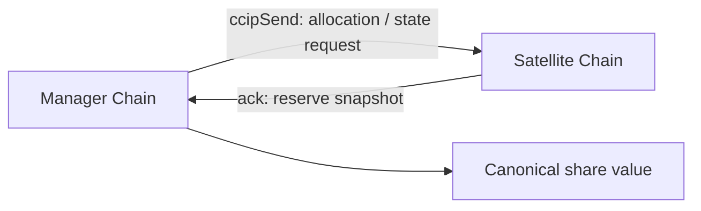
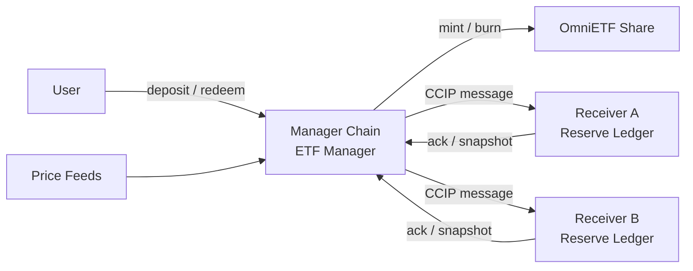

Proof of Concept

# OmniETF

## CCIP 기반 멀티체인 인덱스 ETF

여러 체인에 흩어진 reserve를  
하나의 mintable / redeemable share로 묶을 수 있는가?

<!--
발표자 노트:
이 발표의 핵심은 "CCIP를 써봤다"가 아닙니다.
핵심 질문은 "여러 체인에 분산된 자산 상태가 하나의 금융 객체처럼 동작할 수 있는가"입니다.
저희는 멀티체인 reserve를 하나의 OmniETF share로 발행, 보유, 환급하는 구조를 PoC로 검증하려고 합니다.
-->

---
layout: section
---

# 1. 문제의식

자산은 멀티체인화되었지만  
사용자 경험은 여전히 하나의 포트폴리오를 원합니다.

<!--
발표자 노트:
프로젝트는 토큰화 인덱스 펀드의 온체인화라는 문제의식에서 출발했습니다.
여러 체인에 흩어진 자산을 사용자가 직접 관리하고 인덱싱하는 것은 번거롭고 비용도 큽니다.
저희가 던진 질문은 "사용자가 메인 체인에서 버튼 하나만 눌러서 여러 체인의 자산 가치를 하나의 토큰으로 묶을 수 있는가"입니다.
-->

---
layout: default
---

# 문제: 여러 체인, 여러 상태, 하나의 사용자

- 사용자는 체인별 잔액과 비중을 직접 추적해야 함
- 체인 간 이동과 재구성에는 비용, 시간, 실패 가능성이 존재
- 사용자가 원하는 것은 복잡한 브릿징이 아니라 **하나의 투자 단위**

  One claim surface
  One share supply
  One valuation surface

<!--
발표자 노트:
단일 체인 DeFi는 이미 "여러 underlying position을 하나의 토큰으로 들고 싶다"는 수요를 보여줬습니다.
Index Coop, Set Protocol, Balancer pool token, Enzyme vault 같은 사례가 모두 같은 방향입니다.
하지만 이들은 기본적으로 하나의 accounting domain 안에서 작동합니다.
저희 문제는 accounting domain 자체가 여러 체인으로 흩어졌을 때도 하나의 share가 성립하는지입니다.
-->

---
layout: fact
---

# One Share

복잡한 멀티체인 reserve를  
하나의 OmniETF share로 추상화합니다.

<!--
발표자 노트:
사용자는 여러 체인의 reserve를 직접 보지 않습니다.
사용자는 OmniETF 같은 하나의 share를 보유하고, 프로토콜이 뒤에서 reserve 상태, 교환비, 발행량을 관리합니다.
즉 사용자 관점의 목표는 "멀티체인 포트폴리오를 하나의 토큰처럼 보유하는 경험"입니다.
-->

---
layout: section
---

# 2. 왜 블록체인인가

이 문제는 단순 대시보드가 아니라  
발행, 소각, 교환비, reserve accounting 문제입니다.

<!--
발표자 노트:
여러 체인의 잔액을 보여주는 것만으로는 OmniETF share가 만들어지지 않습니다.
share를 발행하고 소각하려면 어떤 reserve를 얼마만큼 반영했는지, 교환비가 무엇인지, 총 공급량과 NAV가 어떻게 결정되는지가 검증 가능해야 합니다.
그래서 이 문제는 블록체인 기반 로직과 잘 맞습니다.
-->

---
layout: two-cols
---

# 블록체인이 필요한 이유

- 구성 규칙을 공개적으로 강제
- share 발행 / 소각 조건을 컨트랙트화
- reserve 상태와 교환비 계산을 검증 가능하게 기록
- 환급 요청 상태를 온체인에서 추적

::right::

## 우리가 필요한 것

- 단순 asset transfer가 아님
- cross-chain reserve 상태 동기화
- global share value 계산
- 사용자에게 하나의 redeemable claim 제공

<!--
발표자 노트:
이 프로젝트는 "자산을 옮기는 브릿지"를 만드는 것이 아닙니다.
여러 체인의 reserve 상태를 하나의 share value로 묶는 accounting layer를 검증하는 것입니다.
그 과정은 공개된 규칙, 상태 추적, 발행 및 소각 조건이 필요하기 때문에 온체인 로직이 설득력 있습니다.
-->

---
layout: default
---

# 왜 CCIP인가

- arbitrary messaging으로 체인 간 상태 업데이트 전달
- token transfer와 메시지를 함께 설계 가능
- 비동기 cross-chain settlement를 전제로 한 구조
- receiver에서 source chain, sender, router 검증 가능

<!--
발표자 노트:
Chainlink CCIP는 단순 토큰 브릿지가 아니라 arbitrary messaging, token transfer, programmable token transfer를 지원합니다.
공식 문서에서도 index rebalancing 같은 use case가 언급됩니다.
저희에게 CCIP는 자산을 그냥 옮기는 도구가 아니라, 상태 동기화와 settlement instruction을 전달하는 control plane입니다.
-->

---
layout: section
---

# 3. 기존 접근과 차별점

이 프로젝트는 ERC-4626을 그대로 구현하는 것이 아니라  
vault / basket primitive를 멀티체인으로 확장하는 실험입니다.

<!--
발표자 노트:
회의에서 ERC-4626 이야기가 나왔지만, 이 프로젝트를 단순 4626 구현이라고 말하면 약합니다.
4626은 단일 underlying ERC-20 기반 vault 표준입니다.
우리는 그보다 cross-chain basket-share issuance에 가까운 문제를 다룹니다.
-->

---
layout: default
---

# 표준과의 관계

| 표준 | 우리에게 주는 의미 | 한계 |
|---|---|---|
| ERC-4626 | share, mint, redeem의 기본 직관 | 단일 underlying ERC-20 중심 |
| ERC-7540 | 비동기 deposit / redeem 요청 흐름 | cross-chain basket 자체는 정의하지 않음 |
| ERC-7575 | 여러 asset / entry point가 하나의 share 공유 | 체인 간 reserve accounting은 별도 문제 |
| ERC-7621 | basket token, weight, rebalance 개념 | cross-chain execution layer는 구현 관심사 |

<!--
발표자 노트:
딥리서치 결과상 이 표준들 중 cross-chain basket-share issuance를 직접 정의하는 완성된 표준은 찾기 어렵습니다.
그래서 가장 정확한 표현은 "인접 표준의 share semantics, async lifecycle, basket logic을 CCIP 기반 cross-chain accounting으로 확장하는 PoC"입니다.
-->

---
layout: two-cols
---

# 한 문장 차별점

기존 표준이 한 체인 안에서 share를 만드는 법을 다룬다면, 우리는 여러 체인에 분산된 reserve로도 하나의 share가 성립하는지 검증합니다.

::right::

## 즉, 이것은

- 단순 브릿지 데모가 아님
- 단일 체인 vault도 아님
- cross-chain reserve accounting 실험
- one supply, one value, one claim 검증

<!--
발표자 노트:
심사자나 청중이 "그냥 브릿지 아닌가요?"라고 생각할 수 있습니다.
그래서 차별점은 일찍, 강하게 말해야 합니다.
저희의 기여는 token transfer가 아니라 cross-chain 상태를 하나의 canonical share value로 수렴시키는 것입니다.
-->

---
layout: section
---

# 4. 제안 아키텍처

Manager chain이 canonical share를 관리하고  
satellite chain은 reserve 상태를 보고합니다.

<!--
발표자 노트:
PoC 단계에서는 share token 자체를 여러 체인에 풀어놓기보다, manager chain에 canonical share를 두는 것이 가장 방어적인 설계입니다.
복잡도를 줄이면서도 핵심 invariant를 검증할 수 있습니다.
-->

---
layout: default
---

# 시스템 구조

- Manager Chain: total supply, target weight, valuation, mint / burn 결정
- Satellite Chain: local reserve ledger, trusted CCIP message 처리
- CCIP: allocation instruction, state sync, acknowledgement 전달

<!--
발표자 노트:
Manager contract는 총 공급량, 목표 비중, 가치 평가 snapshot, mint/burn 결정을 담당합니다.
각 satellite chain은 local reserve ledger와 receiver contract를 가지고, 신뢰된 CCIP 메시지만 처리합니다.
valuation은 reserve balances와 외부 price input을 이용해 하나의 accounting unit으로 정규화합니다.
-->

---
layout: two-cols
---

# Deposit Flow

1. 사용자가 manager chain에 자산 예치
2. manager가 목표 index weight 계산
3. CCIP로 satellite chain에 allocation message 전송
4. reserve snapshot acknowledgement 수신
5. global basket value 계산
6. OmniETF share 발행

::right::

# Redeem Flow

1. 사용자가 OmniETF 환급 요청
2. share burn 또는 escrow
3. satellite chain settlement message 전송
4. reserve 상태 정산
5. acknowledgement 수신
6. claimable 상태에서 환급 완료

<!--
발표자 노트:
입금은 즉시 mint보다 "상태 반영 후 mint"로 설명하는 편이 안전합니다.
환급은 ERC-7540의 async request model에 가깝습니다.
cross-chain settlement는 본질적으로 비동기이므로 pending, claimable 같은 상태를 두는 것이 설계상 더 자연스럽습니다.
-->

---
layout: fact
---

# Core Invariant

Reserve는 여러 체인에 있어도  
**share supply는 하나**이고  
**share value도 하나**여야 합니다.

<!--
발표자 노트:
이 프로젝트의 본질은 이 invariant를 검증하는 것입니다.
메시지를 보낼 수 있는지보다 중요한 질문은 "분산된 reserve가 하나의 금융 객체처럼 회계 처리될 수 있는가"입니다.
이 invariant가 성립해야 사용자는 하나의 redeemable claim을 가진다고 말할 수 있습니다.
-->

---
layout: section
---

# 5. PoC 범위

완전한 상용 ETF 운용 시스템이 아니라  
멀티체인 reserve accounting의 가능성을 검증합니다.

<!--
발표자 노트:
규제형 ETF를 만드는 것이 아닙니다.
또한 처음부터 완전한 rebalancing engine을 만드는 것도 아닙니다.
핵심은 cross-chain reserve가 하나의 share value로 수렴하는지 보여주는 것입니다.
-->

---
layout: two-cols
---

# 이번 데모에서 보여줄 것

- fixed weight basket
- 예시 비중 50 : 30 : 20
- mocked / pre-funded reserve 상태 동기화
- manager chain에서 OmniETF mint / burn
- redeem request lifecycle 검증

::right::

## Redeem 상태 흐름

  
Pending

  
CCIP ack received

  
Acknowledged

  
valuation finalized

  
Claimable

  
user claim

  
Completed

<!--
발표자 노트:
회의록의 예시처럼 "ETH 5, BTC 1이 교환비에 따라 1 OmniETF가 된다"는 아이디어를 더 시스템적으로 표현하면 fixed weight basket과 canonical share value입니다.
처음에는 실제 모든 자산 이동보다 state aggregation을 먼저 검증하고, 그 다음 programmable token transfer를 붙이는 순서가 좋습니다.
-->

---
layout: default
---

# 구현 계획

| 단계 | 목표 | 산출물 |
|---|---|---|
| 1 | basket / share value 정의 | weight, valuation formula |
| 2 | CCIP payload 설계 | allocation, snapshot, acknowledgement |
| 3 | contract PoC | Manager + Receiver |
| 4 | 테스트넷 검증 | Arbitrum Sepolia / Avalanche Fuji / Base Sepolia 후보 |
| 5 | 발표 데모 | deposit, sync, mint, redeem 시나리오 |

<!--
발표자 노트:
현재는 역할 분담 및 심층 리서치 단계입니다.
CCIP 파트는 ccipSend payload와 receiver validation을 분석하고,
표준 파트는 ERC-4626, 7540, 7575, 7621을 비교하며,
유사 프로젝트 분석은 단일 도메인 인덱스/바스켓 구조와 차별점을 정리합니다.
다음 단계는 아키텍처 확정 후 PoC contract 구현입니다.
-->

---
layout: section
---

# 6. 리스크와 방어 논리

어려운 지점은 메시지 전송보다  
share value를 어떻게 방어 가능하게 정의하느냐입니다.

<!--
발표자 노트:
심사자들이 물을 가능성이 높은 지점은 "CCIP 메시지가 가나요?"보다 "이 share value가 정말 믿을 수 있나요?"입니다.
그래서 valuation, oracle, 초기 가격 조작, message failure, token selection 문제를 미리 인정하고 범위를 제한해야 합니다.
-->

---
layout: two-cols
---

# 주요 리스크

- initial pricing / donation attack
- oracle manipulation
- message delay / failed execution
- rebalance front-running
- fee-on-transfer / rebasing token 문제

::right::

# PoC 방어 전략

- allowlist 기반 단순 ERC-20만 사용
- virtual shares 또는 seeded liquidity 고려
- internal reserve accounting 사용
- static weight 또는 제한된 rebalance
- source chain, sender, router 검증

<!--
발표자 노트:
ERC-7621과 ERC-4626 관련 문서 모두 초기 가격 조작, donated asset, preview function misuse 같은 문제를 경고합니다.
그래서 PoC에서는 단순 자산 allowlist, 내부 회계, 외부 price input, 제한된 rebalance로 범위를 좁히는 것이 설득력 있습니다.
CCIP receiver에서는 source chain, sender, router 검증을 기본 전제로 둡니다.
-->

---
layout: fact
---

# Not “Bridge Tokens Harder”

핵심은 토큰을 더 잘 옮기는 것이 아니라  
멀티체인 reserve가 하나의 금융 객체처럼 동작함을 보이는 것입니다.

<!--
발표자 노트:
이 문장이 결론의 핵심입니다.
저희 프로젝트는 브릿지 성능 비교가 아니라, cross-chain reserve accounting과 share issuance가 결합될 수 있는지를 검증하는 실험입니다.
-->

---
layout: section
---

# 7. 기대 결과

여러 체인의 reserve가  
하나의 온체인 OmniETF share로 표현될 수 있음을 증명합니다.

<!--
발표자 노트:
발표의 마지막 파트에서는 결과물을 명확하게 말합니다.
사용자는 manager chain에서 예치하고, CCIP를 통해 satellite chain 상태가 반영되고, 하나의 OmniETF share가 발행되며, 환급 요청도 비동기 상태 머신으로 처리됩니다.
-->

---
layout: default
---

# 최종 메시지

- 문제: 멀티체인 자산은 흩어져 있지만 사용자는 하나의 투자 단위를 원함
- 접근: CCIP로 reserve 상태를 동기화하고 manager chain에서 canonical share value 계산
- 차별점: 단일 체인 vault가 아니라 cross-chain basket-share accounting
- PoC 목표: one supply, one value, one redeemable claim 검증

Cross-chain reserves can behave like one financial object onchain.

<!--
발표자 노트:
마무리는 간단하게 가져가면 됩니다.
저희는 CCIP를 활용해 멀티체인 reserve 상태를 하나의 share value로 수렴시키고,
그 결과를 바탕으로 발행과 환급이 가능한 OmniETF share 구조를 검증합니다.
즉 "멀티체인 자산을 하나의 투자 객체로 추상화할 수 있는가"에 대한 PoC입니다.
-->

---
layout: end
---

# Thank You

Q&A

<!--
발표자 노트:
예상 질문:
1. 왜 ERC-4626이 아닌가?
답: 4626은 단일 underlying ERC-20 vault라서 share semantics의 참고점일 뿐입니다. 저희 문제는 cross-chain basket accounting입니다.
2. 왜 CCIP인가?
답: arbitrary messaging, token transfer, programmable token transfer를 모두 고려할 수 있고, cross-chain state machine을 만들기에 적합합니다.
3. 초기 PoC 범위는?
답: state aggregation, share value 계산, mint/burn, async redeem lifecycle 검증입니다.
-->
